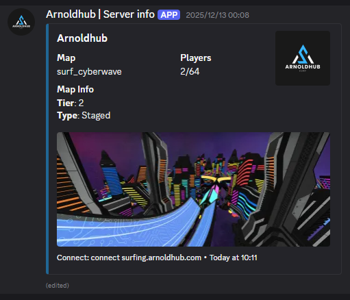

# Server Info Discord Bot

<div align="center">
  
</div>

A Discord bot that displays real-time CS:GO/CS2 surf server information with map details, player counts, and map thumbnails. The bot automatically updates server status in a designated Discord channel.

## Features

- 🎮 Real-time server status monitoring
- 👥 Live player count display
- 🗺️ Current map information with thumbnail images
- 📊 Map tier and type information from local database
- 🔄 Auto-updating status messages (default: every 60 seconds)
- 🐳 Docker support for easy deployment
- ⚙️ Configurable via environment variables

## Prerequisites

- Node.js 20 or higher
- Discord Bot Token ([Create one here](https://discord.com/developers/applications))
- A CS:GO/CS2 server to monitor

## Installation

### Docker Installation

1. Clone the repository:

```bash
git clone https://github.com/yourusername/server-info-discordbot.git
cd server-info-discordbot
```

2. Create a `.env` file:

```bash
cp .env.example .env
```

3. Edit `.env` with your configuration

4. Build and run with Docker Compose:

```bash
docker-compose up -d
```

### Standard Installation

1. Clone the repository:

```bash
git clone https://github.com/yourusername/server-info-discordbot.git
cd server-info-discordbot
```

2. Install dependencies:

```bash
npm install
```

3. Create a `.env` file based on `.env.example`:

```bash
cp .env.example .env
```

4. Edit `.env` and add your configuration:

```env
DISCORD_TOKEN=your_discord_bot_token_here
CHANNEL_ID=your_channel_id_here
SERVER_HOST=your-server.com
SERVER_PORT=27015
```

5. Run the bot:

```bash
npm start
```

## Configuration

All configuration is done through environment variables in your `.env` file:

| Variable          | Description                           | Default                 |
| ----------------- | ------------------------------------- | ----------------------- |
| `DISCORD_TOKEN`   | Your Discord bot token                | Required                |
| `CHANNEL_ID`      | Discord channel ID for status updates | Required                |
| `SERVER_HOST`     | Your game server hostname or IP       | `surfing.arnoldhub.com` |
| `SERVER_PORT`     | Your game server port                 | `27015`                 |
| `SERVER_TYPE`     | Server type for GameDig               | `csgo`                  |
| `UPDATE_INTERVAL` | Update interval in milliseconds       | `60000` (1 minute)      |

## Getting Your Discord Bot Token

1. Go to the [Discord Developer Portal](https://discord.com/developers/applications)
2. Click "New Application" and give it a name
3. Go to the "Bot" section
4. Click "Reset Token" and copy your token
5. Enable "Server Members Intent" and "Message Content Intent" if needed
6. Go to "OAuth2" > "URL Generator"
7. Select scopes: `bot`
8. Select permissions: `Send Messages`, `Embed Links`, `Attach Files`, `Read Message History`
9. Copy the generated URL and invite the bot to your server

## Getting Your Channel ID

1. Enable Developer Mode in Discord (Settings > Advanced > Developer Mode)
2. Right-click on the channel where you want the bot to post
3. Click "Copy Channel ID"

## Map Data

The bot uses a local `surf_.json` file that contains map tier and type information. This file should be a JSON object with map names as keys:

```json
{
  "surf_example": {
    "Tier": 2,
    "Type": "Linear"
  }
}
```

If you're using Docker, you can mount your map database as a volume (see `docker-compose.yml`).

## Customization

### Logo Image

Place your server logo in the `assets/` folder as `arnoldhublogo.png`. The bot will use this as a thumbnail in the status embed.

### Map Images

The bot fetches map images from:

```
https://raw.githubusercontent.com/Letaryat/poor-sharptimermappics/main/pics/{mapname}.jpg
```

You can change this URL in [server-info.mjs](server-info.mjs#L41) to use your own map image repository.

## License

This project is licensed under the MIT License - see the [LICENSE](LICENSE) file for details.

## Contributing

Contributions are welcome! Please feel free to submit a Pull Request.

## Support

If you encounter any issues or have questions, please [open an issue](https://github.com/yourusername/server-info-discordbot/issues).

## Acknowledgments

- [discord.js](https://discord.js.org/) - Discord API library
- [GameDig](https://github.com/gamedig/node-gamedig) - Game server query library
- [Letaryat/poor-sharptimermappics](https://github.com/Letaryat/poor-sharptimermappics) - Map image repository
